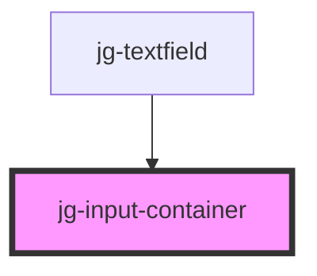

# jg-input-container

<!-- Auto Generated Below -->

## Dependencies

### Used by

 - [jg-textfield](../jg-textfield)

### Graph

----------------------------------------------

*Built with [StencilJS](https://stenciljs.com/)*
