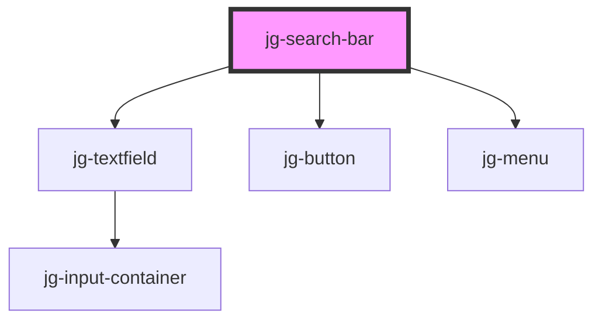

# jg-search-bar

<!-- Auto Generated Below -->

## Properties

| Property | Attribute | Description | Type     | Default     |
| -------- | --------- | ----------- | -------- | ----------- |
| `label`  | `label`   |             | `string` | `undefined` |
| `value`  | `value`   |             | `string` | `""`        |

## Dependencies

### Depends on

- [jg-textfield](../jg-textfield)
- [jg-button](../jg-button)
- [jg-menu](../jg-menu)

### Graph

----------------------------------------------

*Built with [StencilJS](https://stenciljs.com/)*
