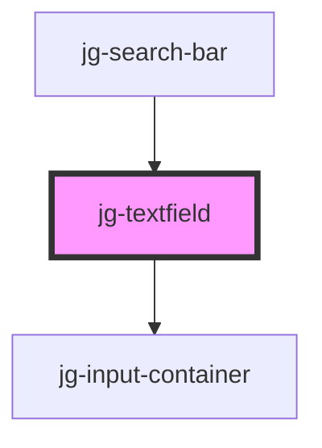

# jg-textfield

<!-- Auto Generated Below -->

## Properties

| Property | Attribute | Description | Type     | Default |
| -------- | --------- | ----------- | -------- | ------- |
| `value`  | `value`   |             | `string` | `""`    |

## Dependencies

### Used by

 - [jg-search-bar](../jg-search-bar)

### Depends on

- [jg-input-container](../jg-input-container)

### Graph

----------------------------------------------

*Built with [StencilJS](https://stenciljs.com/)*
